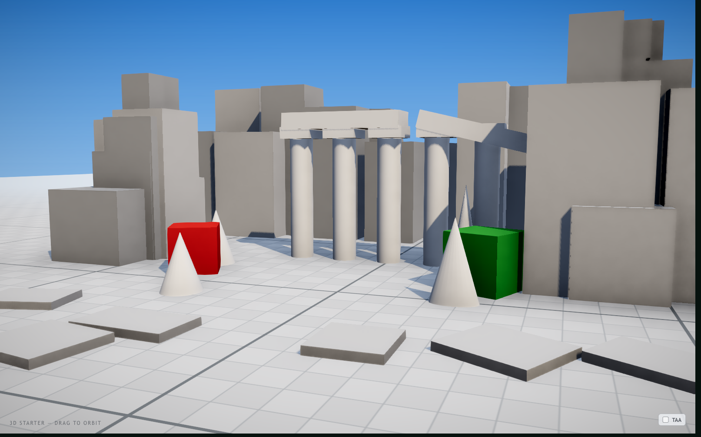

# Three.js Game Starter Kit

A production-grade **Vite 8 + React 19 + TypeScript + Three.js** starter that
ships the two things every browser game re-invents and never gets right the first
time: a **build-time asset optimization pipeline** and a **runtime render budget
that actually holds**. Static *and* dynamic — assets are crushed at build, frames
are cheap at runtime, and a manifest-free preloader ties it together.

Not another "Vite + ESLint" template. This is the boring, hard-won plumbing that
stands between a prototype and something you can ship.



*Live react-three-fiber scene: instanced greybox blockout, a Meshopt-compressed
rigged character, throttled static shadows, N8AO, bloom and ACES tone mapping —
all running at `dpr 1` for a flat frame budget.*

## Two kinds of optimization, one kit

Most templates optimize nothing. This one optimizes on **both** axes, and keeps
them honest with a demo scene you can measure.

### ⚙️ Static — everything shrinks at build time

A pipeline of Vite plugins in [`vite/`](vite/) rewrites your assets as they enter
the graph. No prebuild scripts, no manual manifest, no checked-in optimized
copies — you import the source file, the build ships the small one.

- **3D models** ([glbAssetOptimizerPlugin.ts](vite/glbAssetOptimizerPlugin.ts)) —
  `.glb`/`.gltf` are repacked with [glTF-Transform](https://gltf-transform.dev):
  dedup + prune, textures resized and re-encoded to WebP, optional **Meshopt
  geometry/animation compression** and **albedo-only** stripping. Everything is
  tuned per-import with query flags:

  ```ts
  import hero from './hero.glb'                              // 2048 WebP + cleanup
  import npc  from './npc.glb?texture=1024&albedo&meshopt'   // 1024, base-color only, geometry crushed
  import raw  from './exact.glb?glb-optimize=off'            // opt out entirely
  ```

  A real rigged character in the demo goes **5.2 MB → 0.7 MB (−87%)** with zero
  runtime setup — drei's `useGLTF` wires the Meshopt decoder for you.

- **Audio** ([audioAssetOptimizerPlugin.ts](vite/audioAssetOptimizerPlugin.ts)) —
  MP3s re-encoded with duration-aware bitrate and clip-safe normalization.
- **Images** — `vite-imagetools` transforms + `vite-plugin-image-optimizer`
  (png/jpeg/webp/avif), with a [dev-cache middleware](vite/imagetoolsDevCachePlugin.ts)
  so repeated transforms are instant.
- **Manifest-free preloader** ([bootstrapAssetRegistryPlugin.ts](vite/bootstrapAssetRegistryPlugin.ts)) —
  walks the static import graph, collects every reachable asset into a virtual
  module, and preloads the blocking set before the first frame. Add an asset,
  it's tracked. Delete it, it's gone. The loading bar is byte-weighted, so it
  reflects real download time. Opt anything out with `?bootstrap=deferred`.

### 🎬 Dynamic — the frame stays cheap as the world grows

The demo scene is architected so cost is paid **once**, not every frame.

- **Instancing everywhere** — repeated geometry (blockout, props, cones) draws in
  a single call via drei `<Instances>`; materials/geometries live in one shared,
  shader-warmed registry. A full greybox scene stays in the low-tens of draw
  calls.
- **Static / dynamic split** — world geometry is tagged static and its shadows
  are baked/throttled ([ShadowGroup](src/shared/lib/ShadowGroup.tsx),
  [shadowLayers.ts](src/shared/lib/shadowLayers.ts)); only moving units (the
  animated character) pay per-frame shadow cost.
- **Post at `dpr 1`** — N8AO, bloom, SMAA and tone mapping scale with resolution,
  so the pipeline runs at device-pixel-ratio 1 — the single biggest fps lever on
  retina displays.

## Quick start

```bash
npm install
npm run dev        # http://localhost:5173  — drag to orbit
```

The demo mounts a live scene and a pipeline read-out
([DemoScreen](src/features/pipeline-demo/ui/DemoScreen.tsx)) that lists the exact
assets the build collected for preloading — and only appears once it has painted
its first real frame.

```bash
npm run build      # tsc -b && vite build  ->  dist/
npm run preview    # serve the production build
npm run lint       # eslint (flat config)
npm run test       # vitest + coverage
npm run knip       # dead files / exports report
npm run e2e        # Playwright smoke test
```

## Architecture — FSD layers, ECS inside

`src/` is **Feature-Sliced Design** on the outside, a **Unity-style ECS** within
each feature (see [docs/architecture.md](docs/architecture.md)):

- **entity** — a React component that *is* a game being
  ([`features/<slice>/entities/*.tsx`](src/features/character/entities/Tany.tsx))
- **component** — a hook you attach for per-frame behaviour
  ([`useSpin`](src/shared/lib/useSpin.ts), `useBob`)
- **system** — pure, unit-tested logic, no React/three
  ([`shared/lib/motion.ts`](src/shared/lib/motion.ts))

Scenes ([`src/scenes/`](src/scenes/demo-scene/StarterScene.tsx)) are the
composition root; the dependency direction `app → scenes → features → shared` is
never violated.

## The readiness gate in 30 seconds

A loading screen should hold until the app is *actually visually ready*, not just
until bytes arrive. The two-stage gate ([src/features/bootstrap/](src/features/bootstrap/))
does exactly that:

```tsx
import { BootstrapGate, useReportInitialRenderReady } from './features/bootstrap'

function FirstScreen() {
  useReportInitialRenderReady() // dismisses the overlay after the first real paint
  return <YourApp />
}

createRoot(root).render(
  <BootstrapGate
    prepareSteps={[/* init SDKs, resolve locale, load fonts */]}
    finalizeSteps={[/* hydrate a saved profile */]}
  >
    <FirstScreen />
  </BootstrapGate>,
)
```

Flow: **prepare steps → preload blocking assets → finalize steps → mount hidden
under the overlay → wait for the first real frame → fade out.** Progress is
monotonic and adapts to which stages you provide. With no props it just preloads
and reveals.

## What's inside

| Capability | Where |
| --- | --- |
| GLB/glTF optimizer — textures, Meshopt geometry, albedo-only, per-import flags | [vite/glbAssetOptimizerPlugin.ts](vite/glbAssetOptimizerPlugin.ts) |
| Auto-collected, manifest-free asset preloader | [vite/bootstrapAssetRegistryPlugin.ts](vite/bootstrapAssetRegistryPlugin.ts) |
| Build-time MP3 optimizer + clip-safe normalization | [vite/audioAssetOptimizerPlugin.ts](vite/audioAssetOptimizerPlugin.ts) |
| Image transforms + lossy optimization + dev cache | [vite.config.ts](vite.config.ts) · [imagetoolsDevCachePlugin.ts](vite/imagetoolsDevCachePlugin.ts) |
| Instancing + shared material/geometry registry | [src/features/world/](src/features/world/entities/Blockout.tsx) |
| Static/dynamic render split + throttled shadows | [src/shared/lib/](src/shared/lib/ShadowGroup.tsx) |
| Two-stage readiness gate | [src/features/bootstrap/](src/features/bootstrap/) |
| React Compiler (Babel preset) | [vite.config.ts](vite.config.ts) |
| Strict TS project refs, flat ESLint, Vitest (coverage), Playwright, Knip | root configs |

See [docs/pipeline.md](docs/pipeline.md) for a deep dive on every plugin and the
reasons behind the defaults, [docs/architecture.md](docs/architecture.md) for the
source-layout conventions, and [FEATURES.md](FEATURES.md) for the full inventory.
Agent collaboration rules live in [AGENTS.md](AGENTS.md).

## Deployment

`base: './'` is set in [vite.config.ts](vite.config.ts) so the build is portable
across static hosts that serve from a sub-path (itch.io, Yandex Games S3, GitHub
Pages, plain file servers). For the smallest transfer, make sure your host serves
`.glb` with gzip/brotli — glTF geometry buffers compress well even after Meshopt.

## Requirements

Node 20+. Model optimization uses `@gltf-transform/*` + `sharp` + `meshoptimizer`;
audio uses `mpg123-decoder` + `lamejs`; images use `sharp` + `svgo`. **All are dev
dependencies — none ship in your bundle.**
